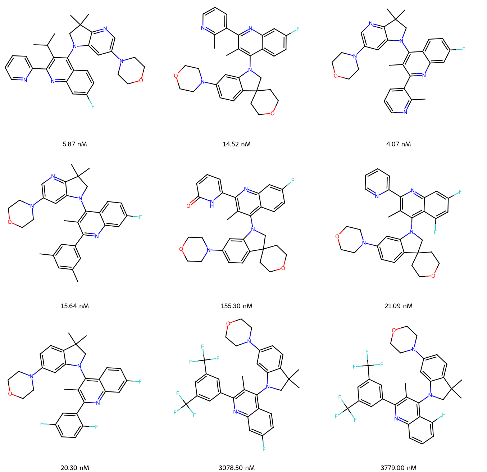

# Activity Cliff identification using BitBIRCH

This repository provides a comprehensive toolkit for identifying and analyzing activity cliffs in molecular datasets using BitBIRCH clustering algorithms.

| (a) Diameter BitBIRCH cluster (contains Activity Cliffs) | (b) Smooth clusters (No Activity Cliffs) |
|:---------------:|:----------------:|
| <div style="background-color: #dbeafe; padding:10px; border-radius:8px;">  </div> | <div style="background-color: #d1fae5; padding:10px; border-radius:8px;">  </div> |
## Overview of methods

This repository provides tools for:
- **Activity Cliff Detection**: Identify pairs of structurally similar molecules with significantly different biological activities
- **BitBIRCH Clustering**: Efficient clustering algorithm optimized for molecular fingerprints
- **Multi-Fingerprint Analysis**: Support for RDKit, ECFP4, and MACCS molecular fingerprints
- **Smooth vs Cliff Clustering**: Compare clustering behavior for activity cliffs vs smooth activity relationships
- **Visualization**: Generate molecular structure visualizations for cluster analysis

## Key Features

- **Flexible Ordering**: Multiple ordering strategies for fingerprint processing (random, sum-based, centroid-based)
- **Recursive Analysis**: Optional recursive clustering to identify additional activity cliffs
- **Comprehensive Benchmarking**: Built-in parameter tuning and performance comparison tools
- **Rich Visualizations**: SVG-based molecular structure displays with activity annotations

## Installation

### Prerequisites
```bash
pip install numpy pandas rdkit matplotlib pillow scikit-learn tqdm
```

This also requires the BitBIRCH module, installation instructions can be found in https://github.com/mqcomplab/bitbirch. 

### Setup
1. Clone the repository:
```bash
git clone https://github.com/Ak-Sure/BitBIRCH_AC.git
cd BitBIRCH_AC
```
## Quick Start

### Data Preparation

#### 1. Generate Fingerprints
Convert SMILES strings to molecular fingerprints:

```python
python gen_fp.py
```

**Input**: CSV files with columns:
- `smiles`: SMILES strings
- `exp_mean [nM]`: Experimental activity values

**Output**: Pickle files containing fingerprints for RDKit, ECFP4, and MACCS

#### 2. Process Library Data
Generate similarity and property difference matrices:

```python
python process_library.py
```

**Output**: Numpy arrays in `files/` directory:
- `fps_*.npy`: Fingerprint arrays 
- `props_*.npy`: Property arrays (log<sub>10<sub>-transformed)
- `tani_matrix_*.npy`: Pairwise Tanimoto similarity matrices (1 if pairwise sim≥ threshold, else 0)
- `prop_diff_matrix_*.npy`: Pairwise Property difference matrices (1 if difference ≥1 log unit else 0)

### Activity Cliff Analysis

Perform comprehensive AC analysis with different parameter combinations:

```python
# Basic analysis
python AC.py --order increasing_sum --recursive False

# Advanced analysis with multiple configurations
python AC.py --order increasing_sum increasing_sum_cent --recursive True False --use_offsets --max_workers 20
```
### Generation and Visualization of Smooth/Cliff Clusters

<div style="text-align: center; display: inline-block;">
  
  <div style="font-size: 16px; font-weight: bold; margin-top: 6px; margin-bottom: 40px;">
    (a) Standard deviation in properties of Diameter BitBIRCH clusters and Smooth Clusters
  </div>
</div>


Our methods naturally lead to a recipe to generate clusters devoid of activity cliffs. tutorial2.ipynb

```python
# Load the input data 

smiles_file='data/CHEMBL4005_Ki.csv'  # Ensure this is consistent with the npy files

from scripts.smooth_ac import FingerprintClusterAnalyzer

#Intialize the analyzer
analyzer = FingerprintClusterAnalyzer(
        fingerprint_types=['ECFP', 'MACCS', 'RDKIT'],
        thresholds=np.linspace(0.3,0.9,7), # Adjust thresholds as needed
        top=10
    )

# Load data and perform clustering
analyzer.load_fingerprint_data(data_prefix='files/fps_CHEMBL4005_Ki_fp_', prop_prefix='files/props_CHEMBL4005_Ki_fp_') 
analyzer.perform_clustering()
analyzer.save_results_to_csv(filename='results/clustering_results_CHEMBL4005_Ki.csv')

# Compare fingerprint types at a specific threshold
analyzer.compare_fingerprint_types(0.9, 1, smiles_file, max_molecules=20) # Visualizes and saves the first (or most populated cluster) across all fingerprint types at 0.9 threshold.
```
## Notebooks

Further details of the code can be found in the `Tutorial.ipynb` notebook.

## Citation

Paper

