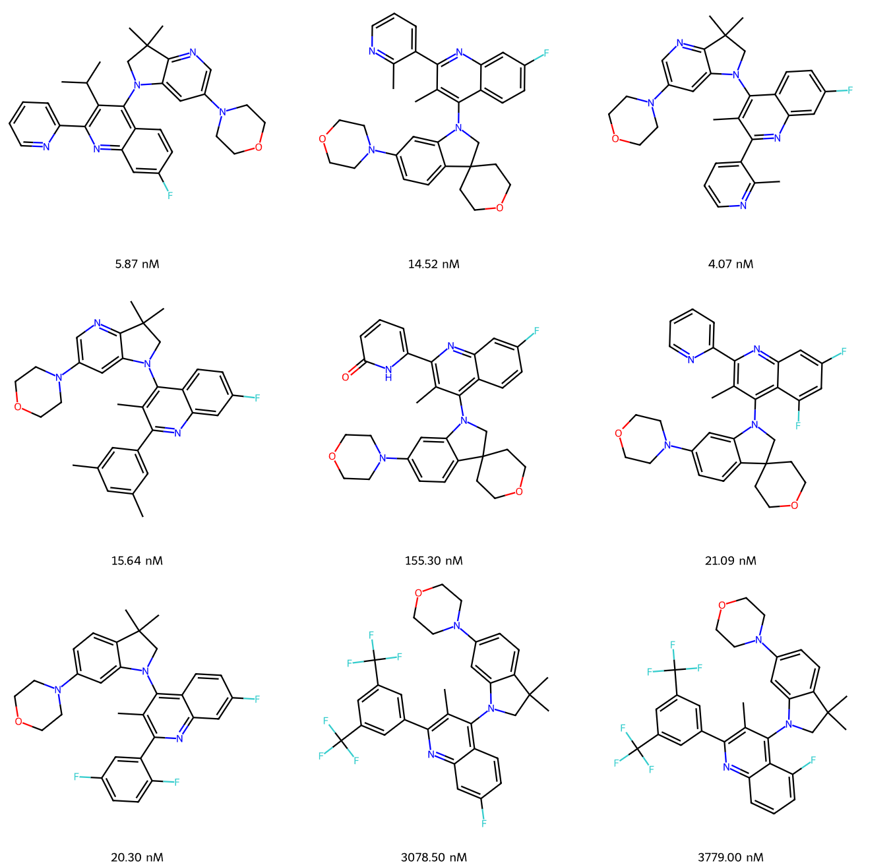
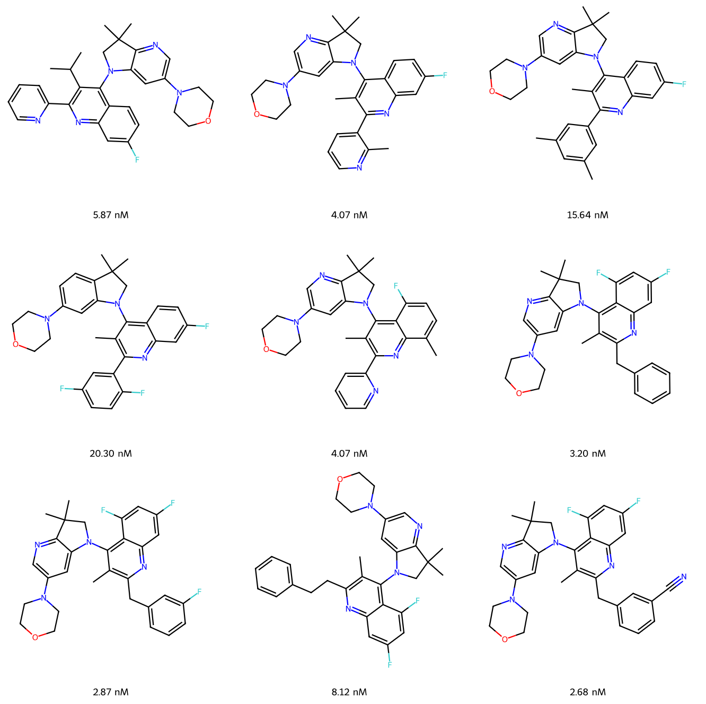

# Activity Cliff Identification using BitBIRCH

A comprehensive toolkit for detecting and analysing **activity cliffs** (ACs) in molecular datasets using the BitBIRCH clustering algorithm.

**Paper:** https://www.biorxiv.org/content/10.1101/2025.09.17.676791v1

| (a) Diameter BitBIRCH cluster (contains Activity Cliffs) | (b) Smooth clusters (No Activity Cliffs) |
|:---:|:---:|
| <div style="background-color:#dbeafe;padding:10px;border-radius:8px;"></div> | <div style="background-color:#d1fae5;padding:10px;border-radius:8px;"></div> |

---

## Overview

This repository provides tools for:

- **Activity Cliff Detection** – identify pairs of structurally similar molecules with significantly different biological activities using BitBIRCH clustering
- **Exhaustive Pairwise Benchmarking** – compare BitBIRCH AC recall against a full pairwise ground truth across thresholds, offsets and fingerprint types
- **Multi-Fingerprint Analysis** – ECFP4 (Morgan r=2, 1024-bit), MACCS (167-bit) and RDKit topological (2048-bit) fingerprints
- **Smooth vs Cliff Clustering** – generate clusters that are provably devoid of activity cliffs
- **Visualisation** – SVG/PNG molecular structure grids, similarity matrices and ratio-vs-threshold comparison plots

---

## Repository Structure

```
BitBIRCH_AC/
├── scripts/
│   ├── AC.py                          # AC analysis (single dataset, pre-existing .npy files)
│   ├── benchmarking.py                # End-to-end pipeline: fingerprints → .npy → AC counts
│   ├── gen_fp.py / gen_fp_parallel.py # Fingerprint generation from CSV
│   ├── process_library.py / _parallel # Convert .pkl to .npy arrays
│   ├── smooth_ac.py                   # Smooth cluster generation and analysis
├── bb_utils/
│   ├── bb_rcent.py                    # BitBIRCH implementation (real centroids)
│   ├── help_funcs.py                  # pair_sim, count_pairs helpers
│   └── generate_plots.py             # Plotting utilities
├── data/                              # Input CSV files (smiles + property column)
├── Tutorial.ipynb                     # Interactive walkthrough
└── README.md
```

---

## Installation

### Prerequisites

```bash
pip install numpy pandas rdkit matplotlib pillow scikit-learn tqdm python-docx
```

BitBIRCH must also be installed separately:

```bash
# See https://github.com/mqcomplab/bitbirch for full instructions
pip install bitbirch
```

### Clone

```bash
git clone https://github.com/mqcomplab/BitBIRCH_AC.git
cd BitBIRCH_AC
```

---

## Quick Start

### Option A – End-to-end benchmarking pipeline (recommended)

`scripts/benchmarking.py` runs all four stages in a single command: fingerprint generation → `.npy` conversion → BitBIRCH AC counting → optional exhaustive pairwise comparison.

```bash
# Benchmark mode: BitBIRCH + exhaustive pairwise recall ratio
python scripts/benchmarking.py \
    --input_dir  data/ \
    --output_dir test_benchmarking/ \
    --benchmarking True \
    --fp_types ECFP MACCS RDKit \
    --threshold 0.9 0.91 0.92 0.93 0.94 0.95 0.96 0.97 0.98 0.99 \
    --order increasing_sum \
    --recursive False True \
    --offsets 0.0 0.3 \
    --prop_col y \
    --max_workers 8
```

Results are saved to `test_benchmarking/results/ac_results_<order>_benchmark.csv` with columns:

| Column | Description |
|---|---|
| `dataset` | Source file + fingerprint type label |
| `fp_type` | ECFP / MACCS / RDKit |
| `threshold` | Tanimoto similarity threshold |
| `offset` | BitBIRCH threshold relaxation (0 = exact) |
| `recursive` | Whether recursive re-clustering was applied |
| `n_acs_bb` | ACs found by BitBIRCH |
| `n_acs_pairwise` | Ground-truth ACs from exhaustive pairwise |
| `ratio` | Recall = n_acs_bb / n_acs_pairwise |

### Option B – AC analysis on pre-existing `.npy` files

If you already have `fps_*.npy` / `props_*.npy` arrays in `test_benchmarking/npy/`:

```bash
python scripts/AC.py \
    --order increasing_sum \
    --recursive False True \
    --use_offsets \
    --offsets 0.0 0.3 \
    --max_workers 20
```

Results are saved to `test_benchmarking/results/` as `Increasing_Sum_With_Offsets_No_Recur.csv` and `Increasing_Sum_With_Offsets_With_Recur.csv`.

---

## Fingerprint Ordering Options

Both scripts accept `--order` with the following choices:

| Option | Description |
|---|---|
| `increasing_sum` | Sort molecules by ascending bit-count (default, most consistent) |
| `decreasing_sum` | Sort by descending bit-count |
| `increasing_sum_cent` | Sort by ascending Tanimoto similarity to dataset centroid × bit-count |
| `random` | Random permutation |
| `identity` | Original CSV order |

---

## Offset Parameter

The `offset` parameter lowers the BitBIRCH clustering threshold relative to the AC detection threshold:

```
BitBIRCH threshold = similarity_threshold − offset
```

A larger offset groups more molecules into the same cluster, potentially recovering more ACs that would otherwise be split across clusters. `offset=0.0` is the strictest setting.

---

## Smooth Cluster Generation

BitBIRCH can also generate clusters guaranteed to contain no activity cliffs:

```python
from scripts.smooth_ac import FingerprintClusterAnalyzer
import numpy as np

analyzer = FingerprintClusterAnalyzer(
    fingerprint_types=['ECFP', 'MACCS', 'RDKIT'],
    thresholds=np.linspace(0.3, 0.9, 7),
    top=10
)

analyzer.load_fingerprint_data(
    data_prefix='CHEMBL4005_Ki_fp',
    prop_prefix='CHEMBL4005_Ki_fp'
)
analyzer.perform_clustering()
analyzer.save_results_to_csv('results/clustering_results_CHEMBL4005_Ki.csv')

# Visualise top cluster at threshold 0.9
analyzer.compare_fingerprint_types(0.9, 1, 'data/CHEMBL4005_Ki.csv', max_molecules=20)
```

---

## Comparing Result Files

Use `bb_utils/generate_plots.py` or the plotting utilities in `Tutorial.ipynb` to compare ratio-vs-threshold across configurations:

```python
import pandas as pd
from bb_utils.generate_plots import plot_comparison_by_threshold

df_no_recur = pd.read_csv('results/Increasing_Sum_With_Offsets_No_Recur.csv')
df_recur    = pd.read_csv('results/Increasing_Sum_With_Offsets_With_Recur.csv')

# Compare recursive vs non-recursive at offset=0.3
plot_comparison_by_threshold(df_recur, df_no_recur, offset1=0.3, offset2=0.3)
```

---

## Notebooks

| Notebook | Contents |
|---|---|
| `Tutorial.ipynb` | Full walkthrough: fingerprint generation, AC detection, smooth clustering, benchmarking and ratio comparison plots |

---

## Citation

If you use this code, please cite:

> BitBIRCH AC — bioRxiv preprint  
> https://www.biorxiv.org/content/10.1101/2025.09.17.676791v1

